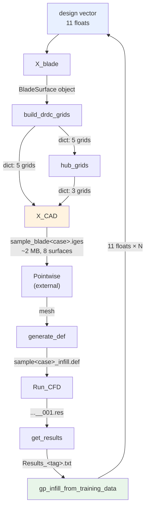

# Pipeline Interface Reference

Black-box spec for each component: **parameters in, data out, and what
connects to what.** No internals — treat each box as a function with a
contract.

Reference case throughout: 5 blades, diameter `D = 1.4 m`.

---

## 1. Data flow



`X_CAD_from_design` wraps the first four boxes into one call if you don't need
the intermediates.

---

## 2. Design vector — the only pipeline input

`pitch_con` (6 floats) + `chord_con` (5 floats) = **11 floats**, all bounded.

| Index | Array | Min | Max |
|---|---|---|---|
| 0 | `pitch_con[0]` | 0.60 | 1.25 |
| 1 | `pitch_con[1]` | 0.00 | 1.00 |
| 2 | `pitch_con[2]` | 0.35 | 0.75 |
| 3 | `pitch_con[3]` | 0.05 | 0.50 |
| 4 | `pitch_con[4]` | 0.05 | 0.50 |
| 5 | `pitch_con[5]` | 0.40 | 0.85 |
| 6 | `chord_con[0]` | 0.15 | 0.30 |
| 7 | `chord_con[1]` | 0.45 | 0.85 |
| 8 | `chord_con[2]` | 0.05 | 0.50 |
| 9 | `chord_con[3]` | 0.25 | 0.70 |
| 10 | `chord_con[4]` | 0.05 | 0.30 |

Defined in `Initial_sampling.py` (`pitch_bounds`, `chord_bounds`). Must match
`gp_infill_from_training_data.py`.

---

## 3. Geometry components

### 3.1 `X_blade` — `x_blade_new.py`

```python
X_blade(pitch_con, chord_con, x1, *,
        return_bezier_info=False, return_blade_surface=False,
        bezier_constraint_mode='project', apply_coupled_constraints=None,
        write_dat=True)
```

| Parameter | Type | Default | Notes |
|---|---|---|---|
| `pitch_con` | float[6] | — | design vector part 1 |
| `chord_con` | float[5] | — | design vector part 2 |
| `x1` | int | — | case id |
| `return_blade_surface` | bool | `False` | **must be `True`** to feed the next stage |
| `write_dat` | bool | `True` | writes `ORCA<case>.dat` |

**Returns** a tuple:

| Position | Name | Type / size |
|---|---|---|
| 0 | `points` | float[3021, 3] — section point cloud |
| 1 | `min_dis` | float — min blade-to-blade clearance |
| 2 | `constraint_violation` | int — **non-zero ⇒ reject the design** |
| 3 | `chord_con_points` | float[N, 2] |
| 4 | `pitch_con_points` | float[N, 2] |
| 5 | `Pitch` | callable |
| 6 | `ChordLength` | callable |
| −1 | `blade_surface` | `BladeSurface` object *(only if requested)* |

**File out:** `ORCA<case>.dat`, ~103 KB (if `write_dat=True`).
**Time:** 0.08 s.
**Connects to:** `build_drdc_grids(blade_surface)`.

> Check `constraint_violation` before continuing. Infeasible designs must not
> reach the CAD stage.

### 3.2 `build_drdc_grids` — `tip_surfaces_new.py`

```python
build_drdc_grids(blade, cfg=None, verbose=True, row_cache=None)
```

**In:** `blade` = the `BladeSurface` from `X_blade`.
`cfg` = `TipConfig()` dataclass (below); `None` uses defaults.

**Out:** `dict` of 5 numpy arrays `(rows, cols, 3)` in **metres**, plus `meta`.

| Key | Shape (defaults) | Points | Memory |
|---|---|---|---|
| `te_strip` | (25, 241, 3) | 6 025 | 141 KB |
| `central_pressure` | (25, 28, 3) | 700 | 16 KB |
| `le_strip` | (25, 241, 3) | 6 025 | 141 KB |
| `central_suction` | (25, 28, 3) | 700 | 16 KB |
| `tip` | (28, 241, 3) | 6 748 | 158 KB |
| `meta` | dict | — | counts, split points, diagnostics |

**Time: ~85 s** — the pipeline's geometry bottleneck.
**Connects to:** `hub_grids(grids)` and `X_CAD(grids, ...)`.

`TipConfig` parameters you may touch:

| Parameter | Default | Effect |
|---|---|---|
| `delta_c` | 0.02 | curve spacing (·D). **Drives grid size and runtime** |
| `n_wrap` | 241 | columns per wrap grid |
| `strip_width` | 0.07 | LE/TE strip width (·D) |
| `eta_top` | 0.64 | radial station of the patch split |
| `tip_cluster` | 0.6 | tip-cut clustering |
| `n_iter` | 0 | smoothing iterations — **leave at 0** |
| `max_curves` | 120 | safety cap on curve count |

Halving `delta_c` roughly doubles grid size and runtime. All other fields have
working defaults; changing them is not required to run the pipeline.

### 3.3 `hub_grids` — `hub_new.py`

```python
hub_grids(grids, hub_height=None, hub_center=0.0, n_blades=5,
          n_s=121, n_x=61, n_rho=25, cap_inner_radius=0.0, verbose=True)
```

**In:** `grids` = the dict from `build_drdc_grids` (reads the blade root ring
from it to size the hub).

| Parameter | Default | Notes |
|---|---|---|
| `hub_height` | `None` → 1.0 m | total axial height. **Keep fixed across a batch** |
| `hub_center` | 0.0 | hub midpoint x. **Keep fixed** |
| `n_blades` | 5 | sector spans 360/Z° |
| `cap_inner_radius` | 0.0 | 0 = closed ends; > 0 = shaft bore radius |
| hub **radius** | — | **not a parameter** — measured from the blade |

**Out:** `(dict, info)`

| Key | Shape | Points | Memory |
|---|---|---|---|
| `hub_sector` | (121, 61, 3) | 7 381 | 173 KB |
| `hub_cap_lo` | (25, 121, 3) | 3 025 | 71 KB |
| `hub_cap_hi` | (25, 121, 3) | 3 025 | 71 KB |
| `info` | dict | — | radius, extents, Z, clearances |

Reference values: radius **0.119000 m**, hub x ∈ [−0.500, +0.500], sector 72°.

**Time:** < 0.01 s.
**Connects to:** `X_CAD` (called internally by it — you rarely call this
directly).

**Raises** if the hub can't be built correctly (non-cylindrical root, hub too
short, or blades would overlap at the chosen `n_blades`).

### 3.4 `X_CAD` / `X_CAD_from_design` — `X_CAD_new.py` *(needs pythonOCC)*

```python
X_CAD(grids, x1, output_dir=None, hub=True, hub_height=None,
      hub_center=0.0, n_blades=5)

X_CAD_from_design(pitch_con, chord_con, x1, output_dir=None,
                  tip_config=None, write_dat=False, verbose=True,
                  hub=True, hub_height=None, hub_center=0.0, n_blades=5)
```

`X_CAD_from_design` is the **one-call path**: design vector → IGES. Use it
unless you need the intermediate grids.

| Parameter | Default | Notes |
|---|---|---|
| `x1` | — | case id, used in the filename |
| `output_dir` | `None` | `None` ⇒ `pipeline_config` default location |
| `hub` | `True` | `False` = blade only |
| `hub_height` / `hub_center` / `n_blades` | 1.0 / 0.0 / 5 | passed to `hub_grids` |
| `tip_config` | `None` | a `TipConfig`, or `None` for defaults |

**Out:**

| Item | Value |
|---|---|
| file | `sample_blade<case>.iges` |
| size | **1.8 – 2.1 MB** |
| surfaces | **8** — 5 blade + hub sector + 2 hub caps |
| units | mm |
| total points | 33 629 |

Return value is the OCC shape; the path comes from
`cad_output_paths(case_id, output_dir)["iges"]`.

```python
# design vector -> IGES, one call
from X_CAD_new import X_CAD_from_design
X_CAD_from_design([1.025, 0.525, 0.55, 0.325, 0.325, 0.55],
                  [0.25, 0.65, 0.325, 0.55, 0.2], 1001)
```

**Connects to:** Pointwise (meshing, external).

> Raises rather than writing bad geometry if any surface fails its
> export check.

### 3.5 `cad_worker.py` — subprocess wrapper

```bash
python cad_worker.py <case_id> <geometry_dir> <design_path>
```

Runs `X_CAD_from_design` in a separate process so a hang in pythonOCC can be
killed by timeout. Used by `Initial_sampling.py`; call it directly if your
platform schedules CAD jobs itself.

---

## 4. Sampling

### `Initial_sampling.py`

| | |
|---|---|
| **In** | bounds (11 × 2), `N_GENERATED_BLADES`, `INPUT_MODE` |
| **Out** | `generated_<tag>_control_points.txt`, `rejected_<tag>_control_points.txt`, `input__var_values_<tag>.dat`, one IGES per accepted case |
| **Method** | Latin hypercube (`scipy.stats.qmc`, seed 100) |

Per case it calls `cad_worker.py` with a timeout, so one bad design cannot
stall the batch.

---

## 5. CFD chain (external solver)

| Component | In | Out | Size |
|---|---|---|---|
| `generate_def.py` | mesh + `create_def.pre` | `sample<case>_infill.def` | — |
| `Run_CFD.py` | `.def` | `sample<case>_infill_001.res` | ~100 MB |
| `Check_def.py` | `.def` | validity report | — |
| `get_results.py` | `.res` | `export<N>_<case>.csv` → `Results_<tag>.txt` | small |

`Results_<tag>.txt` columns:

```
case   J   kT   kQ   thrust   torque   drag   total_resistance   CD   CP
```

---

## 6. Surrogate / infill

### `gp_infill_from_training_data.py` (or `..._pso.py`)

| | |
|---|---|
| **In** | `training_data_<tag>.dat` — **13 columns** = 11 design vars + 2 objectives |
| **Out** | next-round control points, `<tag>_predictions.txt`, `poly_fit_eq_<tag>.txt` |
| **Model** | Gaussian Process (Matérn + White) |
| **Acquisition** | `ESPSOLS.py` (default) or `PSO_function.py` |

`Gp_classifier.py` — optional feasibility filter; in: same training data, out:
feasible/infeasible prediction, used to skip designs likely to fail.

**Output feeds back to** `X_blade` as the next round of design vectors.

---

## 7. File and directory contract

| Path | Written by | Read by |
|---|---|---|
| `geometry/<TAG>/ORCA<case>.dat` | `X_blade` | reference only |
| `geometry/<TAG>/sample_blade<case>.iges` | `X_CAD` | Pointwise |
| `input__var_values_<tag>.dat` | `Initial_sampling` | CFD bookkeeping |
| `New_training/training_data_<tag>.dat` | you (assembled) | GP infill |
| `New_training/Results_infill<n>.txt` | `get_results` | GP infill |

Paths resolve via `pipeline_config.py`, relative to its own location:

```python
cad_output_paths(case_id, geometry_dir=None)
# -> {"dir", "orca_dat", "iges", "stl"}
```

`New_training/` and `geometry/` are **data, not code** — not in the repo.
Create them or repoint `DATA_DIR` in `pipeline_config.py`.

---

## 8. Environment

| Component | Requirement |
|---|---|
| `X_CAD_new.py`, `cad_worker.py`, `Initial_sampling.py` | **pythonOCC** — `conda activate pyocc310` |
| everything else | numpy, scipy, sklearn |

---

## 9. Cost per design

| Stage | Time | Output |
|---|---|---|
| `X_blade` | 0.08 s | 3 021 points |
| `build_drdc_grids` | **85 s** | 20 198 points |
| `hub_grids` | < 0.01 s | 13 431 points |
| `X_CAD` → IGES | ~2 s | ~2 MB, 8 surfaces |
| meshing + CFX | external | ~100 MB |

Geometry ≈ 90 s per design, dominated by `build_drdc_grids`. Raise `delta_c`
to trade surface resolution for speed.

---
